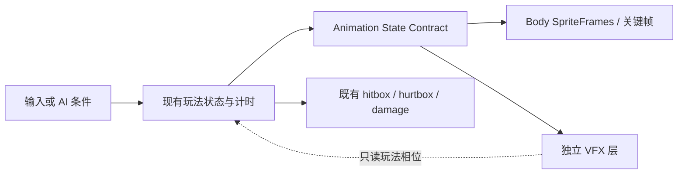

# Stage 17 动作运行态稳定化设计

## Summary

Stage 17 的唯一主目标是把 Luna、四类普通敌人与 Seal Guardian 的动作从“资源已绑定”推进到“运行时状态、关键帧、时长和模型比例一致”。本阶段不扩房间数量，不新增敌人种类，也不把元素、姿态和序列连锁塞进同一阶段。

本设计承接以下已确认事实：

- Luna 运行节点始终固定为 `position = Vector2(0, -16)`、`scale = Vector2(0.45, 0.45)`；比例跳变来自动作源图人物比例、脚底基线、留白和播放时序。
- 玩家攻击逻辑总时长为 `0.23s`，Air Dash 为 `0.24s`，现有完整动画分别约 `0.89s` 与 `0.80s`，不能直接自然播放。
- Jump / Fall 当前把整条 24 帧序列按时间播放，没有根据起跳、上升、下落和落地选帧。
- 四类普通敌人的运行态 `AnimatedSprite2D` 已绑定资源，但没有启动播放。
- Boss 把攻击判定、攻击表现和恢复混在同一状态链中；攻击 body / VFX 被 `0.18s` 截断，攻击后恢复与护印击破又共用 `staggered`，导致视觉隐藏且 `stagger_duration` 没有真正承担独立硬直时长。

权威证据：

- `docs/assets/2026-07-11-character-enemy-animation-runtime-audit.md`
- `spec-design/2026-07-11-alpha-demo-room-content-catalog.md`
- `spec-design/2026-07-11-north-star-implementation-audit.md`
- `spec-design/2026-06-24-animation-runtime-replacement-pass.md`

## Goals

- 固定 Luna Model Lock v1，并让运行代码不再通过动作资源隐式改变角色尺度或锚点。
- 建立可测试的 `Animation State Contract`，由玩法状态和计时决定显示帧，而不是让长素材自由播放后被状态截断。
- 让四类普通敌人的现有循环真正播放，并为已有行为补最小状态映射和死亡动作。
- 将 Boss 的 `recovery` 与 `staggered` 拆开，保证攻击、VFX、恢复和护印击破全程有可见动作。
- 留下自动化测试、运行探针和人工复核证据，证明帧真正推进，而不只证明资源路径存在。

## Non-Goals

- 不改变 39 房数量、房间职责、敌人空间分布或门控结构。
- 不新增普通敌人类型，不把普通敌人升级成完整商业版 AI。
- 不在 Stage 17 实现 Miasma Caster 真实投射物；其当前仍是瘴气压力原型。
- 不在 Stage 17 实现元素池、符印姿态、两步序列、装备、技能树或任务系统。
- 不引入通用动画框架、动画状态机插件或新的第三方依赖；继续使用现有 `AnimatedSprite2D`、GDScript 状态和 SpriteFrames。
- 不通过放慢玩家攻击或 Air Dash 来迁就长素材，也不把完整 16 帧暴力倍速压进短窗口。

## 方案比较与决定

### 方案 A：把玩法时长拉长到素材时长

- 优点：素材可自然播放完。
- 缺点：玩家攻击从 `0.23s` 变成约 `0.89s`、Air Dash 从 `0.24s` 变成约 `0.80s`，会直接破坏当前移动、战斗和能力门手感。
- 结论：不采用。

### 方案 B：完整素材统一倍速播放

- 优点：改动少。
- 缺点：攻击和 Dash 需要约 `3.3-3.9x` 倍速，关键姿势不可读，Jump / Fall 仍无法响应物理相位，Boss 恢复隐藏也没有解决。
- 结论：不采用。

### 方案 C：玩法时序保持不变，按状态选择关键帧

- 优点：保留已验证手感；动作帧与 startup / active / recovery、速度方向和 Boss 状态一一对应；测试可直接验证状态、帧和时长。
- 缺点：需要补一层明确的帧映射，并为确实不满足 Model Lock 的动作重新生成少量候选。
- 结论：采用。它是最小的根因修复，也是 Stage 17 的正式方案。

## Stage Boundary / Preflight

当前 `codex/demo-level-formal-remap` 工作树包含大量未提交地图、资产和运行时改动。Stage 17 实现不得直接叠在未收口现场上。

开始实现前必须满足：

1. 当前工作树的正式地图重排改动已完成差异审查并形成可回退提交点。
2. 明确 Stage 17 以哪个提交为基线；默认在固定永久工作树中创建 `codex/stage-17-animation-runtime-stabilization`。
3. `project.godot` 不残留临时 MCP autoload。
4. 先跑现有全量 GUT 和 Godot import，记录 Stage 17 前基线。

## Luna Model Lock v1

以下规则是 Stage 17 退出门槛，不是生成提示词建议：

| 字段 | 锁定值 / 规则 |
| --- | --- |
| Model ID | `luna_model_v1` |
| Canonical reference | `luna_idle_runtime_sheet_ai03` |
| Cell | `192x192` |
| Runtime node | `LunaRuntimeAnimationVisual` |
| Runtime transform | `position = (0, -16)`、`scale = 0.45`，任何动作不得单独补偿 scale |
| Ground foot baseline | grounded 动作 `foot_y = 176 +/- 2px` |
| Center line | `center_x = 96 +/- 2px` |
| Standing body height | `140 +/- 6px` |
| Airborne rule | 姿态包围盒可变，但头、躯干、四肢、服装和法器比例必须与 canonical reference 一致 |
| VFX rule | slash、seal arc、dash trail、hit spark 与 body sheet 分离 |

当前 `luna_jump_fall_runtime_sheet_ai03` 已被审计证明人物体量明显偏小，Stage 17 必须生成并接入 `luna_jump_state_runtime_sheet_ai04`，不能只靠节点缩放掩盖问题。Attack、Air Dash、Hit React 先按状态关键帧接入；若 Model Lock 人工复核仍失败，则只重生成失败动作，不整批重做。

## Luna Animation State Contract

### Idle / Run / Death

- `idle`、`run` 继续按 loop 自然播放。
- `death_idle` 继续完整播放并停在终帧。
- 三者都使用固定 runtime transform。

### Attack

- 玩法时长保持：startup `0.05s`、active `0.08s`、recovery `0.10s`，总计 `0.23s`。
- Body 使用现有 ai03 的关键帧索引 `[4, 6, 7, 8, 10, 12]`，而不是从第 0 帧自然播放：
  - startup：`4`
  - active：`6, 7`
  - recovery：`8, 10, 12`
- Slash / seal arc 在 active 开始时显示，并按同一攻击相位映射自己的关键帧；攻击结束统一隐藏。
- 命中判定仍由现有 startup / active / recovery 逻辑决定，VFX 不成为伤害来源。

### Air Dash

- `dash_duration = 0.24s` 保持不变。
- Body 使用关键帧 `[0, 2, 4, 6, 7, 8]`，按 dash normalized progress 映射。
- 最后一帧仍保持冲刺姿态，不使用 ai03 后半段提前回站姿的恢复帧。
- Dash trail 继续是独立纯视觉层。

### Jump / Rise / Fall / Land

- 新资源 `luna_jump_state_runtime_sheet_ai04` 使用 Model Lock v1，包含固定语义：
  - `jump_start`：3 帧
  - `rise_hold`：2 帧
  - `fall_hold`：2 帧
  - `land`：4 帧
- `_start_jump()` 启动 `jump_start`；上升期根据 `velocity.y` 进入 `rise_hold`；下落期进入 `fall_hold`；落地计时进入 `land`。
- `rise_hold` 与 `fall_hold` 可保持或轻循环，不允许整条序列播完后在空中回站姿。

### Hit React

- 新增独立视觉计时 `hit_react_visual_duration = 0.20s`。
- 使用 ai03 关键帧 `[0, 2, 4, 5]`，在 `0.20s` 内完成受击姿态。
- 玩家无敌时间继续为 `0.35s`；受击动作结束后恢复当前移动 / 空中动作，但受击闪色可持续到无敌结束。
- 死亡优先级高于受击，无敌状态不允许覆盖死亡动作。

## 普通敌人 Animation State Contract

共享规则放在 `BaseEnemy`，避免四个脚本各自修同一问题：

- `_ready()` 在准备运行视觉层后启动当前默认 animation。
- 所有敌人通过共享 `_play_runtime_animation(...)` 切换 SpriteFrames、animation、asset_id 和朝向。
- `receive_attack(...)` 立即关闭 collision / hurtbox 并发出 `defeated`，保持房间门控语义不变；视觉改为播放 defeat clip，而不是立刻隐藏。
- defeat clip 完成后保持终帧或隐藏，但不得影响门控、奖励或房间切换。

各敌人最小映射：

| 敌人 | 现有行为映射 | 新增最小资产 | 明确不做 |
| --- | --- | --- | --- |
| Basic Melee | `basic_melee_cycle` 作为 `idle_move` loop | `enemy_basic_melee_defeat_runtime_sheet_ai02` | 不伪造当前不存在的主动近战攻击窗口 |
| Ground Charger | patrol 使用现有 cycle；触发后先进入 `0.12s` telegraph，再按现有 charge / recover 推进 | `enemy_ground_charger_action_runtime_sheet_ai02`、`enemy_ground_charger_defeat_runtime_sheet_ai02` | 不增加追踪、转向或新伤害判定 |
| Aerial Sentinel | `aerial_sentinel_cycle` 作为 hover loop | `enemy_aerial_sentinel_defeat_runtime_sheet_ai02` | 不新增俯冲或弹体攻击 |
| Miasma Caster | `miasma_caster_cycle` 与现有压力 pulse 同步 | `enemy_miasma_caster_defeat_runtime_sheet_ai02` | 不新增真实投射物 |

## Seal Guardian Animation State Contract

Boss 状态拆分为：

- `idle`
- `close_pressure`
- `ground_impact` / `air_punish`
- `recovery`
- `staggered`
- `defeated`

关键规则：

- `strike_duration = 0.18s` 继续表示伤害前的 strike 窗口。
- strike 阶段映射 attack body / VFX 的帧 `0-3`，在 strike 结束边界只结算一次伤害。
- 随后进入新的 `recovery`，映射 attack body / VFX 的帧 `4-7`；二阶段允许按较短 recovery 压缩映射，但不截断为隐藏。
- `staggered` 只用于护印击破，时长使用现有但此前未真正使用的 `stagger_duration = 0.7s`。
- 新增 `seal_guardian_stagger_runtime_sheet_ai01`；staggered 全程可见，不再落入默认隐藏分支。
- `recovery` 和 `staggered` 结束时恢复 guard 并进入 idle；两种状态的进入原因、时长和动画互不混用。

## Data Flow

动画层读取玩法状态，不反向驱动伤害、位移、门控或房间流程。

## Error Handling / Fallback

- 运行节点或 SpriteFrames 缺失时保留现有灰盒视觉，不允许角色完全隐形。
- 目标 animation 名不存在时输出一次明确错误并退回默认 idle / cycle，不静默隐藏。
- 资产生成候选未通过 Model Lock、边界、帧序或人工复核时，不替换 live resource。
- 运行探针若发现 `frame` 不推进、状态中 visible=false、动作结束仍停留错误姿势，Stage 17 不得收口。

## Test Strategy

- GUT 验证状态、帧序、时长、资源、transform、VFX 与 damage window。
- Python 严格审计验证 Model Lock、cell、脚底基线、中心线和跨动作尺寸。
- 运行探针记录 Luna、四类普通敌人和 Boss 的 `state / animation / frame / is_playing / visible` 时间序列。
- 人工复核至少覆盖攻击、Air Dash、跳跃四相、受击、四类敌人、Boss strike / recovery / staggered / defeat。

## Stage 18 Follow-up Gate

Stage 17 通过后，下一正式玩法阶段单独设计“最小北极星战斗身份切片”：`2 元素 + 2 姿态 + 2 步序列`。该阶段必须重新做 brainstorming、设计文档和正式计划；Stage 17 只为它提供稳定、可读的动作与状态基础。
