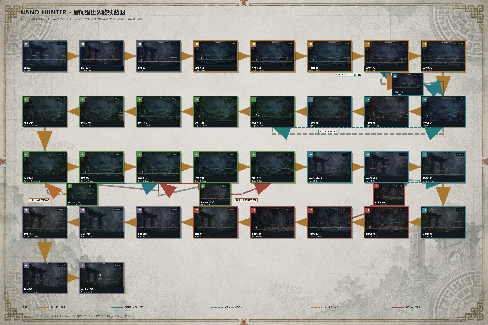
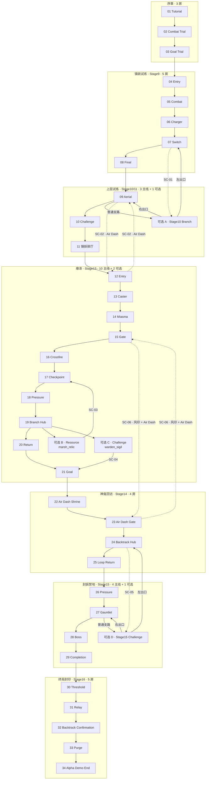
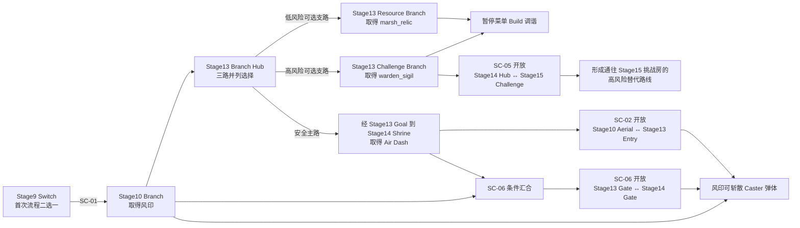

# Alpha Demo 世界地图组成与路线蓝图

## 文档定位

本蓝图把当前已经实装的房间连接、区域回环、可选支路和能力回访关系集中到一张可审阅的地图中。它依据当前场景导出字段、Stage18 世界图回归和 input-only 首次通关路线整理，不是脱离代码的未来概念图；逐房内容核对见 `spec-design/2026-07-28-alpha-demo-room-blueprint-matrix.md`。

- 地图内容：`34` 个首次通关房间 + `4` 个可选房间，共 `38` 个正式地图房间。
- 工程总数：另有 `test_room` 机制沙盒，因此当前为 `39` 个可运行房间。
- 路线结构：`3` 个区域回环、`6` 条远端连接、风印与 Air Dash 两项探索能力、`2` 个可切换 Build。
- 图示边界：本图表达连接拓扑、先后关系和门控，不代表房间的真实二维坐标、距离或海拔；Stage19 已在 `assets/configs/world_map/alpha_demo_world_map.json` 另行冻结运行时地图 UI 的归一化展示坐标。

## 房间级确认图

图中每张编号卡片都是一个真实房间运行截图；Stage 只出现在卡片右上角作为区域 / 开发分组，不是路线节点。它冻结的是 Stage18 / Stage19 时点：金色蛇形线为 `01` 至 `34` 的首次通关骨架，A–D 为四个正式可选房，虚线和标注只到 SC-05。图像模型只生成无文字制图底板，房间截图、编号、名称、连线和门控均按当时场景契约确定性合成。

该蛇形线只用于一张可打印的历史房间截图总表，不是运行时地图美术规范；Stage19 运行态已改为五区域星座、弧形墨线和符印节点，Stage20 的 SC-06 及门控条件直接由 JSON 绘制，无需重生成底板。

| 历史分组 | 正式房间数 | 蓝图编号 |
| --- | ---: | --- |
| 序章 | 3 | 01–03 |
| Stage9 | 5 | 04–08 |
| Stage10 | 3 | 09、10、A |
| Stage11 | 1 | 11 |
| Stage13 | 12 | 12–21、B、C |
| Stage14 | 4 | 22–25 |
| Stage15 | 5 | 26–29、D |
| Stage16 | 5 | 30–34 |
| 合计 | 38 | 34 个首次路线房 + 4 个可选房 |

Stage 编号来自历史开发批次和场景命名，不等同于玩家看到的“第几关”。例如 Stage12、Stage17、Stage18 分别承担资产 / 打磨、动作稳定化和世界图重构，不会因此各新增一个同名地图房间；编号缺口也不表示路线缺房。

## 图例

| 表达 | 含义 |
| --- | --- |
| 实线箭头 | 首次通关可用的主路、普通支路或普通返回出口 |
| 虚线箭头 | 远端连接、能力门控或持久奖励门控 |
| `SC-01` 至 `SC-06` | Stage18–20 定义的六条远端连接 |
| `wind_seal` | 风印，来自早期 Stage10 Branch；可斩散 Caster 弹体，也是 SC-06 条件之一 |
| `marsh_relic` | 瘴泽遗物，来自 Stage13 Resource Branch |
| `warden_sigil` | 镇妖挑战符，来自 Stage13 Challenge Branch |

## 一、区域级拓扑

```mermaid
flowchart LR
    START["教程至 Stage9 Entry"]

    subgraph LOOP_A["环路 A · 镇妖试炼上层回路"]
        direction LR
        A_SW --> A_FINAL["Stage9 Final"]
        A_FINAL --> A_AERIAL["Stage10 Aerial"]
        A_AERIAL -->|普通支路| A_BRANCH["Stage10 Branch\n获得风印"]
        A_BRANCH -->|左出口| A_SW
        A_SW -. "SC-01 · 首轮可用" .-> A_BRANCH
        A_BRANCH -->|右出口| A_AERIAL
    end

    START -->|经 Combat / Charger| A_SW
    A_AERIAL --> A_CHALLENGE["Stage10 Challenge"]
    A_CHALLENGE --> S11["Stage11 镇妖驿厅"]
    A_AERIAL -. "SC-02 · Air Dash" .-> B_ENTRY
    B_ENTRY -. "SC-02 · Air Dash" .-> A_AERIAL

    subgraph LOOP_B["环路 B · 瘴泽分流回路"]
        direction LR
        B_ENTRY -->|经 Caster / Miasma| B_GATE["Stage13 Gate"]
        B_GATE -->|经 Crossfire| B_CHECKPOINT["Stage13 Checkpoint"]
        B_CHECKPOINT --> B_PRESSURE["Stage13 Pressure"]
        B_PRESSURE --> B_HUB["Stage13 Branch Hub"]
        B_HUB -->|主路| B_RETURN["Stage13 Return"]
        B_RETURN --> B_GOAL["Stage13 Goal"]
        B_HUB -->|低风险资源支路| B_RESOURCE["Resource Branch\n获得 marsh_relic"]
        B_RESOURCE -->|SC-03 · 单向回环| B_CHECKPOINT
        B_HUB -->|高风险清场支路| B_CHALLENGE["Challenge Branch\n获得 warden_sigil"]
        B_CHALLENGE -->|SC-04 · 单向前送| B_GOAL
    end

    S11 --> B_ENTRY
    B_GOAL --> C_SHRINE["Stage14 Shrine\n获得 Air Dash"]

    subgraph LOOP_C["环路 C · 神龛至封妖禁地回路"]
        direction LR
        C_HUB --> C_LOOP["Stage14 Loop Return"]
        C_LOOP --> C_PRESSURE["Stage15 Pressure"]
        C_PRESSURE --> C_GAUNTLET["Stage15 Gauntlet"]
        C_GAUNTLET -->|普通挑战支路| C_CHALLENGE["Stage15 Challenge"]
        C_CHALLENGE -->|左出口| C_HUB
        C_HUB -. "SC-05 · warden_sigil" .-> C_CHALLENGE
        C_CHALLENGE -->|右出口| C_GAUNTLET
    end

    C_SHRINE --> C_GATE["Stage14 Air Dash Gate"]
    C_GATE --> C_HUB
    B_GATE -. "SC-06 · 风印 + Air Dash" .-> C_GATE
    C_GATE -. "SC-06 · 风印 + Air Dash" .-> B_GATE
    C_GAUNTLET --> BOSS["Stage15 Boss"]
    BOSS --> COMPLETE["Stage15 Completion"]
    COMPLETE -->|Stage16 五房终局链| END["Alpha Demo End"]
```

这张图确认当前宏观结构已经不是单纯的一条线：三个区域各有闭合回路，Stage10、Stage13 和 Stage15 均存在可选房。但是首次通关的安全骨架仍是单向推进，回环和远端连接主要承担回访价值，因此玩家在取得 Air Dash 之前仍会明显感到线性。

## 二、全部房间组成

## 三、能力与回访解锁顺序

## 四、当前设计确认

| 检查项 | 当前结果 | 设计判断 |
| --- | ---: | --- |
| 首次通关房间 | 34 | 已形成完整 Tutorial 至 Stage16 End 骨架 |
| 可选房间 | 4 | 已有分支，但数量和分布仍偏少 |
| 区域闭合回环 | 3 | 已满足 Alpha 宏观世界图目标 |
| 远端连接 | 6 | 四条双向、两条单向；SC-06 为双能力交叉门 |
| 核心能力回访 | 风印 + Air Dash | 风印提供战斗反制，二者共同开放 SC-06 |
| 持久探索收益 | 3 | 风印为能力，`marsh_relic` / `warden_sigil` 为可切换 Build |
| 锚点房 | 12 组 | 已接入秘密墙、碑文、机关、危险与区域地标 |
| 首次通关可达性 | 可达 | 不使用可选捷径仍可到达 Stage16 End |
| Boss 约束 | 不可跳过 | Stage15 捷径只改变挑战路径，不绕过 Boss |

## 五、为什么仍会感觉“一条路走到底”

1. `34` 房的首次安全路线仍是一条明确长骨架；Stage9 Switch 已提供首轮第二路线，但它会在 Stage10 Aerial 汇流。
2. 真正跨区域重排移动的 Air Dash 仍到 Stage14 才取得；SC-06 增加了交叉回访，但不会跳过能力授予。
3. 四个可选房里仍有三个集中在 Stage13–15，早期只有 A 房这一条支路，分支密度尚未达到完整商业银河城。
4. Stage19 发现式地图解决了“已有环路但玩家看不见”；它不替代更多区域交叠、快速旅行或区域完成度设计。
5. 两种 Build 已改变恢复或攻击判定，但尚未形成装备词条、套装、技能树或剧情选择网络。

## 六、仍未冻结或未实现的地图设计

- 房间自身在连续世界中的二维坐标、相对高度和米制距离没有定义；Stage19 只冻结了地图 UI 的归一化展示坐标。
- 暂停菜单已实现当前房、已发现房、相邻轮廓和 SC-01 至 SC-06 状态；正式存档、快速旅行、缩放 / 拖拽、独立出入口图标和区域完成度仍未实现。
- 当前路线通过自动化证明可达，但真人首次通关、迷路率、回访发现率和分支选择率仍未签核。
- 现有三环路、一个早期支路和一组双能力交叉门足以作为 Alpha Demo 拓扑基线，不等于完整类银河恶魔城所需的多组交叉门控、区域交叠和中后期自由选路。

## 七、后续设计使用方式

后续调整房间连接时，应先在本蓝图更新区域关系，再同步修改场景导出字段、`alpha_demo_world_map.json` 和 Stage18 / 19 / 20 测试。若只移动地图上的展示位置或改显示条件，修改 JSON 即可；若只是调整单房平台、敌人、陷阱或视觉构图，不应改动本图，除非它改变了入口、出口、门控、回环或房间职责。
