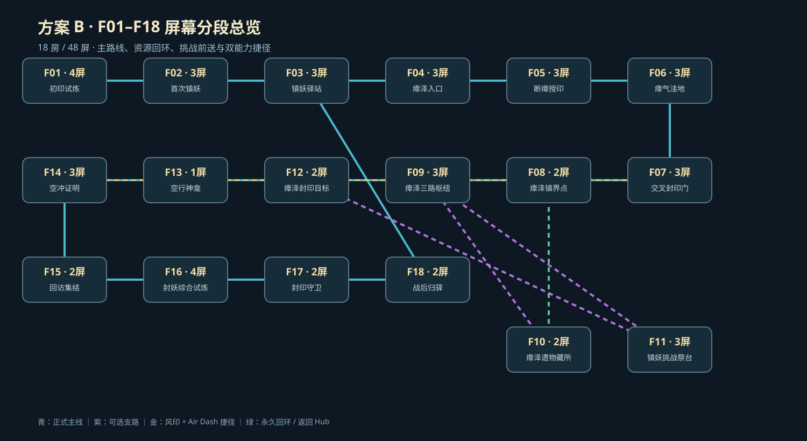

# 正式 Demo 第二阶段：F01–F18 逐房结构蓝图与屏幕分段

## 交付定位

本阶段把已批准的方案 B 从“18 房职责与技术拓扑”推进到“可施工的逐房空间设计”。交付包含 `18` 张俯视式结构蓝图、`1` 张总览图、`48` 个横版镜头段和机器可读清单。

这里的“俯视式”是关卡设计审阅投影：用平面路线表达玩家从哪条高度线进入、在哪里分岔、回落和切房；运行玩法仍为横版 2D，不改成俯视游戏。

本阶段不修改生产 `.tscn`，也不生成正式背景、建筑或装饰资产。蓝图是下一阶段重做碰撞、平台、相机、敌人、机关和场景美术的施工依据，不能被表述为房间运行时已经完成。

## 管线合同

- `map_mode`: `side_scroll_mode`
- `engine_target`: Godot `4.6.3` project-native
- `visual_model`: 当前为结构蓝图；运行时目标仍是 `parallax_layers + platform_objects + interactive_scene_objects + scene_hooks + precise_shapes`
- 逻辑镜头：`640×360` Godot 世界单位
- 基础网格：`32u`
- 正常房间：`2–3` 个镜头段
- 例外：F01 / F16 为 `4` 屏，F13 为单屏神龛，F17 为前室 + 单屏锁镜 Boss arena
- 总量：`18` 房、`48` 屏

移动距离引用 `tests/artifacts/local/room-design-recovery/movement-metrics/metrics.json`：

| 用途 | 水平间距 | 最小落点 |
| --- | ---: | ---: |
| 安全教学 | `58.53–87.80u` | `48u` |
| 普通主线 | `80.48–109.75u` | `36u` |
| 常规挑战 | `102.43–124.39u` | `36u` |
| 高难可选 | `124.39–139.02u` | `36u` |

实测 Air Dash 位移为约 `110u`。首次主线不得使用 `95%` 以上理论极限。

## 总览

图例：

- 青色实线：首次主线；
- 紫色虚线：资源 / 挑战支路；
- 金色虚线：能力回访与永久捷径；
- 绿色虚线：熟练快速路线或返回 Hub；
- 灰色 / 红色虚线：安全回落或本地重试；
- 圆点：入口、出口、地标、敌人、危险、检查点、能力门等结构节点。

## 逐房蓝图索引

| 房间 | 正式职责 | 屏数 | 结构节拍 | 蓝图 |
| --- | --- | ---: | --- | --- |
| F01 初印试炼 | 四段基础教学 | 4 | 行步 → 跳跃 → Dash → 攻击 | [查看](formal-demo-room-blueprints/F01-tutorial_room.svg) |
| F02 首次镇妖 | 首次实战与任务确认 | 3 | 观察 → 单敌 → 结算 | [查看](formal-demo-room-blueprints/F02-combat_trial_room.svg) |
| F03 镇妖驿站 | 正式循环 Hub | 3 | 恢复 → 整备 → 区域出口 | [查看](formal-demo-room-blueprints/F03-stage11_demo_end_room.svg) |
| F04 瘴泽入口 | 区域揭示与地标 | 3 | 高岸全景 → 下泽 → 能力门远景 | [查看](formal-demo-room-blueprints/F04-stage13_miasma_marsh_entry_room.svg) |
| F05 断瘴授印 | 风印与弹体反制教学 | 3 | 看弹体 → 安全授印 → 移动应用 | [查看](formal-demo-room-blueprints/F05-stage13_miasma_marsh_caster_room.svg) |
| F06 瘴气洼地 | 静态危险与能力回访 | 3 | 上层安全线 → 下层奖励线 → 汇流 | [查看](formal-demo-room-blueprints/F06-stage13_miasma_marsh_miasma_room.svg) |
| F07 交叉封印门 | 能力门预告与永久捷径 | 3 | 看门 → 首次绕行 → F08 / F14 分流 | [查看](formal-demo-room-blueprints/F07-stage13_miasma_marsh_gate_room.svg) |
| F08 瘴泽镇界点 | 恢复与方向重置 | 2 | 安全恢复 → F10 回环落点 | [查看](formal-demo-room-blueprints/F08-stage13_miasma_marsh_checkpoint_room.svg) |
| F09 瘴泽三路枢纽 | 三路分岔与复用 | 3 | 预读 → 三高度选择 → 三种出口 | [查看](formal-demo-room-blueprints/F09-stage13_miasma_marsh_branch_hub_room.svg) |
| F10 瘴泽遗物藏所 | 低风险探索支路 | 2 | 可读秘密墙 → 遗物 → 单向回 F08 | [查看](formal-demo-room-blueprints/F10-stage13_miasma_marsh_resource_branch_room.svg) |
| F11 镇妖挑战祭台 | 高风险前送支路 | 3 | 可退入口 → 三层战斗 → 发奖前送 | [查看](formal-demo-room-blueprints/F11-stage13_miasma_marsh_challenge_branch_room.svg) |
| F12 瘴泽封印目标 | 区域目标与能力前置 | 2 | 双入口汇流 → 封印目标 → 神龛方向 | [查看](formal-demo-room-blueprints/F12-stage13_miasma_marsh_goal_room.svg) |
| F13 空行神龛 | Air Dash 安全授予 | 1 | 单一焦点授予 | [查看](formal-demo-room-blueprints/F13-stage14_air_dash_shrine_room.svg) |
| F14 空冲证明 | 展示、练习与强制应用 | 3 | 演示 → 安全练习 / 回落 → 真空冲证明 | [查看](formal-demo-room-blueprints/F14-stage14_air_dash_gate_room.svg) |
| F15 回访集结 | 回访状态与 Boss 集结 | 2 | 三印回照 → Boss 路线 | [查看](formal-demo-room-blueprints/F15-stage14_backtrack_hub_room.svg) |
| F16 封妖综合试炼 | 能力参与的综合战斗 | 4 | 近战 → 冲锋 → 空中层 → 清场门 | [查看](formal-demo-room-blueprints/F16-stage15_mixed_gauntlet_room.svg) |
| F17 封印守卫 | Boss 高潮 | 2 | 安全前室 / 本地重试 → 锁镜 arena | [查看](formal-demo-room-blueprints/F17-stage15_seal_guardian_boss_room.svg) |
| F18 战后归驿 | 战后降压与返回 Hub | 2 | 结果反馈 → 驿路法坛回 F03 | [查看](formal-demo-room-blueprints/F18-stage15_completion_room.svg) |

## 屏幕分段总表

### F01–F03：开场簇（10 屏）

- F01 S1 行步庭：连续宽地面建立移动和镜头；入口后 `160u` 为安全观察区。
- F01 S2 跃阶：两级安全跳跃，失误落回下层地面。
- F01 S3 疾行廊：低顶门楣教学地面 Dash；不使用深坑。
- F01 S4 初印照壁：单靶攻击教学；出口与战斗触发分离。
- F02 S1 望敌台：玩家先看见敌人，再进入战区。
- F02 S2 镇妖坪：单敌应用；清场结界只封前方。
- F02 S3 悬令台：同一房间完成任务确认和离场；回访永久开放。
- F03 S1 归队庭：承接教程，提供恢复和多入口安全出生。
- F03 S2 镇妖驿厅：赏榜、悬钟、战后返回与整备。
- F03 S3 瘴泽界门：用坡向和远景指向 F04，不放孤立门扇。

### F04–F12：瘴泽区域簇（24 屏）

- F04 S1–S3：高岸全景、折线下泽、倒塔滩；首次看到后期能力门的空间轮廓。
- F05 S1–S3：安全看弹体、无敌授予风印、移动中斩弹；不叠加混战。
- F06 S1–S3：上下路线同时可见；首次走安全上层，Air Dash 后走下层奖励 / 高速线。
- F07 S1–S3：门前庭、双印断桥、首次绕行出口；未满足能力条件时绝不移动玩家。
- F08 S1–S2：无敌净水池和方向重置坡；F10 从上层单向落入且不碰主出口。
- F09 S1–S3：先远读三高度，再在三幡地标选择，最后用不同环境语义分开三个出口。
- F10 S1–S2：低风险秘密墙和遗物藏所；以可预见滑道回到 F08，绝非死亡坑。
- F11 S1–S3：入口可退出，三层战斗提供两条脱离线，清场后发奖并前送 F12。
- F12 S1–S2：F09 / F11 双入口安全汇流；完成泽心封印后用上行石阶指向 F13。

### F13–F15：能力与回访簇（6 屏）

- F13 S1：单屏对称神龛；无敌、安全、能力授予后出口立即可读。
- F14 S1：无压力展示 Air Dash。
- F14 S2：上层短跨练习、下层安全回落；下层连接 F07 捷径。
- F14 S3：`105–110u` 真空冲证明，宽落点；危险区不得覆盖起跳、落点或回落层。
- F15 S1：上下入口汇流，显示 F06 / F07 / F09 三处回访状态，不在本房集中发奖。
- F15 S2：安全集结坡和唯一 Boss 路线。

### F16–F18：高潮与回 Hub（8 屏）

- F16 S1：阵前缓冲和单近战，可退回入口。
- F16 S2：冲锋廊，用 Dash 跨越或反向处理地面压力。
- F16 S3：双层空中战，Air Dash 是快线而非唯一生路。
- F16 S4：汇流清场，妖气结界消散后进入 F17。
- F17 S1：Boss 前室、本地 checkpoint、读招与重试缓冲。
- F17 S2：单屏锁镜 Boss arena，实体边墙封场，不依赖全局跌落边界。
- F18 S1：解印天井，用开阔轮廓完成战后降压。
- F18 S2：驿路法坛明确返回 F03；通过交互或明确触发切房，不能靠跑出地板。

## 房间切换与跌落安全合同

本蓝图专门冻结以下约束，避免重现“门控失效后玩家跑出地板，被全局恢复误判为深坑”的问题：

1. 每个普通入口至少提供 `160u` 连续安全地面；出生点不与任一出口、危险或机关触发器重叠。
2. 相邻户外切房使用连续地面、缓坡、洞口、栈道或雾幕边界；远端返回使用驿路法坛；两者都不与跌落边界共用。
3. 所有首次主线失误都回落在当前房间的可踩地形；全局跌落恢复只兜底真正越出房间，不承担正常关卡设计。
4. 能力门条件不足时只阻挡和反馈，不能把玩家推到地板外，也不能发切房请求。
5. 单向回环必须由明确落差、滑道或法坛表现，在进入前可预读其不可逆性质。
6. Boss arena 使用实体边界和本地重试点，失败后 `10–25` 秒内恢复可操作。

## 机器可读产物与再生成

- 清单：[formal-demo-room-blueprints.json](formal-demo-room-blueprints/formal-demo-room-blueprints.json)
- 生成器：`tools/level_design/generate_formal_demo_room_blueprints.ps1`
- 运行：`powershell -ExecutionPolicy Bypass -File tools/level_design/generate_formal_demo_room_blueprints.ps1`

JSON 冻结每房：场景路径、段数、空间地标、持久状态、首次 / 支路 / 回访 / 快速路线、结构节点和每屏的职责、几何、压力与安全要求。SVG 仅为同一数据的审阅视图，不是运行时背景，也不应被切片为碰撞来源。

## 下一阶段施工顺序

1. 先把 F04–F09 六房按蓝图重做生产碰撞、平台、入口安全区和相机边界。
2. 做 F04→F09 首次路线、F09→F10→F08 回环、F07↔F14 捷径的真人灰盒。
3. 通过后再施工 F01–F03、F10–F18；每房按屏段单独验收，不批量套模板。
4. 灰盒结构通过后，才开始正式瘴泽背景、倒塔、镇界柱、三幡枯桥、Air Dash 神龛与 Boss 封印建筑的资产生产和运行时分层接入。

本阶段的完成定义仅为“18 房结构蓝图与屏幕分段已冻结并可施工”。生产场景、美术资产、真人手感与最终 Demo 仍是后续门禁。

## 2026-08-26 后续修订

运行态路由修正和逐房审计证明，结构蓝图还不足以作为 F01–F18 的完整玩法施工模板。后续施工顺序现由 `spec-design/2026-08-26-formal-demo-room-blueprint-v2-design.md` 与 `plan/2026-08-26-formal-demo-room-blueprint-v2.md` 接管。BPV2-01–09 已于 2026-08-26 补齐玩家认知、连接交互、遭遇、能力状态、失败恢复、相机、表现、地图与 QA；唯一机器清单现为 `schema_version=2`。本文件继续保留为 v1 结构历史基线，不替代 Blueprint V2 机器真源。
